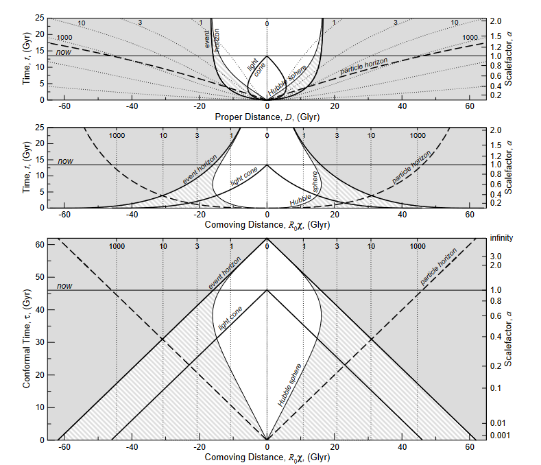

## 宇宙が膨張しているならば、非常に遠くの天体は大きく見えるはずなのでは？

[cosmology - shouldn't very very distant objects appear magnified? - Astronomy Stack Exchange](https://astronomy.stackexchange.com/questions/54499/shouldnt-very-very-distant-objects-appear-magnified)

各径距離の転回（Angular diameter distance turnaround）といい、たとえばビッグバンから4億年後の銀河（距離320億光年）が27億光年離れた銀河と同じ大きさに見えるという。

理屈は以下のような感じらしい（図の出典は[\[astro-ph/0310808\] Expanding Confusion: common misconceptions of cosmological horizons and the superluminal expansion of the Universe](https://arxiv.org/abs/astro-ph/0310808)）。

[cosmology - Understanding The Turnover Point of Angular Diameter Distance - Astronomy Stack Exchange](https://astronomy.stackexchange.com/questions/21006/understanding-the-turnover-point-of-angular-diameter-distance)

> On the one hand an object spans a smaller angle the farther away it is, as expected. On the other hand, due to the expansion of the Universe and the finite speed of light, very distant objects were closer to us when they emitted the light we see today. At that time they spanned a larger angle.
>
> The following paragraph is hard to understand without a drawing , so have a look at the drawing in this answer, which may help. The light from the edges of a galaxy that happened to travel toward where we were at the time it was emitted did not reach us, because by the time it arrived to that place, we were no longer there. But the light that happened to be emitted toward some point behind us reached that point at the same time as we did, so that's what we see.
>
> The exact turnover, the threshold between "looking smaller because far away" and "looking larger because closer in the past" depends on the expansion rate history of the Universe, as well as on the way that light propagates in the Universe, which in turn depends on the densities od the various constituents of the Universe. The interrelationship of these quantities is given by the Friedmann equation.

## エチオピア人移民

[Hundreds of migrants killed by Saudi border guards - report - BBC News](https://www.bbc.com/news/world-middle-east-66545787)

Human Rights Watch（HRW）の報告書。サウジアラビア国境警備隊が移民を銃殺。サウジアラビアは移民の殺害を否認している。なお、移民と言っても記事にあるように、イエメンとエチオピアの密輸入業者が手引している密入国者である点は注意。

年間20万人がエチオピアないしソマリアからイエメン経由でサウジアラビアに渡航を試みている。非常に危険なルートであり、ジブチ沖ではしょっちゅう船が難破するし、イエメンの移民ルートには途中で死亡した人の墓が転がっている。

HRWの報告書によると爆発物を用いた28の事件と14件の銃撃事件が起きている。事件の組織性が強く疑われるが、サウジ側は否認している。Mixed Migration Centreは腐敗した遺体が国境一帯に散乱している様子や、国境警備隊が捕縛した移民にどちらの足を先に撃たれたいか尋ねる様子、逃げ惑う人々に機関銃や迫撃砲で攻撃を行う様子など、凄惨な状況を報告している。

HRWの報告は非常に詳細で、多数の殺害が行われた場所と、仮誂えの埋葬地について複数の証言と衛星写真付きで報告している。

モナビの移民収容センターについて。武装した密輸業者により国境前で移民が収容されている。密輸業者とイエメンのフーシ派反政府勢力が協働して手引きしているとも。
