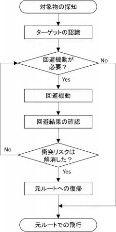

## FTX創業者の訴追

[アラメダ元ＣＥＯ、ＦＴＸ創業者が顧客資金流用を指示と証言 | ロイター](https://jp.reuters.com/markets/japan/funds/HRSK2HN27BL2JKI5YVPXYJXVTI-2023-10-11/)

この件の技術的詳細。

[The fraud was in the code - Molly White](https://newsletter.mollywhite.net/p/the-fraud-was-in-the-code)

詐欺師もキレイなソースコードを書くらしい。

## パレスチナ

[【随時更新】パレスチナ ガザ地区 唯一の発電所が操業停止 | NHK | イスラエル・パレスチナ](https://www3.nhk.or.jp/news/html/20231012/k10014222521000.html)

イスラエルは人道問題を起こす道を選んだのではないか。

## 光ファイバー

[光ファイバー1本で世界最大容量22.9ペタビット／秒を実証、NICTが発表 - INTERNET Watch](https://internet.watch.impress.co.jp/docs/news/1538151.html)

- 光ファイバーの伝送量
  - 従来の世界記録は10.66Pb/s
  - NICTの既存手法
    - マルチコア（ケーブル内のコアを複数化）
    - マルチモード（コア中の光の伝搬モードを複数科）
    - マルチバンド波長多重
      - 波長帯域として商用のC帯、L帯と非商用のS帯の全帯域を活用
- 多コア化に伴う干渉分離の必要性
  - 従来は4コアファイバー中心
  - 38コア3モード光ファイバーを採用
    - より多くの光経路を持つ
    - 信号道士の干渉を分離するため、MIMO受信機をマルチバンド伝送に対応させる必要がある
- 実験内容
  - 38コア光ファイバーを使用
  - 波長帯域S帯・C帯・L帯
    - 波長数合計750
  - 周波数18.8THz
  - 変調方式は偏波多重256QAM方式
- 結果
  - 4コアファイバーと比べ、光経路の数を28.5倍に拡大できた
  - コア毎で0.3～0.7Pb/s、全38コアで22.9Pb/sの伝送容量を得た
    - 現在の商用光通信システムの1000倍
- 結論
  - マルチコア・マルチモードの空間多重技術とマルチバンド波長多重の併用がはじめて実証できた
  - 将来の通信量は現在の1000倍以上に
    - さらなる高度化が求められる

## ナナフシ

[飛べない昆虫「ナナフシ」の長距離分散の痕跡を遺伝解析で発見 ～鳥の摂食による移動は頻繁に起こっていた!?～ | Research at Kobe](https://www.kobe-u.ac.jp/research_at_kobe/NEWS/news/2023_10_11_01.html)

- 既存研究
  - ナナフシは飛べないため、移動能力に乏しい
  - ナナフシの卵が鳥に食べられると、一部の卵は無傷で排泄され孵化することが知られていた
  - この現象は低頻度のため、自然条件でナナフシの分布拡大に寄与しているかは不明だった
- 今回研究
  - 全国から採集したナナフシの遺伝構造を調査
  - 683km離れたところで同一のミトコンドリア配列が確認された
    - 鳥により長距離分散を示す状況証拠といえる

## 無線ドローン

[日本主導による「ドローン衝突回避」の国際規格 - Impress Watch](https://www.watch.impress.co.jp/docs/news/1537893.html)

- ドローン利用の広がり
  - 中型無線航空機はすでに農業分野などで利用が広がっている
  - 今後、災害時の物資運搬や遭難者捜索、物流インフラの用途も期待される
- 課題
  - ドローンとドクターヘリのニアミス事例が報告される
  - 衝突回避が喫緊の課題
  - 「目視外飛行」「第三者上空飛行」の実現にも衝突回避技術は必須
  - 無線航空機には飛行ルールがない
    - たとえば有人機では、同一高度で2機が対向して飛行している場合、どちらも右側に避けるルールがある
  - 国際ルールもないため、各メーカー内でしか回避ルールが通用しないという状況
  - 経済産業省が国際規格化案の策定を開始
- 無線航空機の衝突回避手順
  - 運行ルール自体は2019年11月にISO21384-3にて策定済
    - 当時は回避ルールについては言及なし
    - 2023年の改定で「衝突回避のCONOPS（Concept of Operations）」として章追加
  - 以下の6ステップからなるアルゴリズムで回避
    - 

## トランスジェンダー

[戸籍上性別変更に手術必要の規定「憲法違反で無効」静岡家裁 | NHK | LGBTQ](https://www3.nhk.or.jp/news/html/20231012/k10014223241000.html)

- 争点
  - 性同一性障害の特例法
  - 戸籍上の性別を変えるには生殖能力をなくす手術が必要とする規定
  - 違憲性があるとしたのは憲法13条と14条1項？
- 違憲とした理由
  - > 生殖腺を取り除く手術は、生殖機能の喪失という重大で不可逆的な結果をもたらす
  - > 性別変更のために一律に手術を受けることを余儀なくされるのは、社会で混乱が発生するおそれの程度や医学的見地からみても、必要性や合理性を欠く
  - > 特例法の施行から19年余りがたち、性の多様性を尊重する社会の実現に向けて国民の理解の増進が求められるなど、社会的な状況の変化が進んでいる
- その他
  - FtMとMtFで要件が違うという指摘あり
    - https://twitter.com/URUWA_L_O/status/1712382044402299265

## うまい棒

[「うまい棒」工場から泡あふれ列車が一時運転見合わせ 茨城 | NHK | 茨城県](https://www3.nhk.or.jp/news/html/20231012/k10014223211000.html)

## 全固体電池

[トヨタと出光が「全固体電池」の量産化へ 協業することで合意 | NHK | EV（電気自動車）](https://www3.nhk.or.jp/news/html/20231012/k10014223051000.html)

- 協業
  - 両者で数十人規模のチームを編成
  - 出光が保有する千葉県の実証プラント施設を活用
  - 固体電解質の検証を進める
  - 早ければ2027年に実用化を目指す

## 旧統一教会の解散命令

[旧統一教会の解散命令 請求を正式決定 盛山文科相 | NHK | 旧統一教会](https://www3.nhk.or.jp/news/html/20231012/k10014222851000.html)

大学教授らからなる宗教法人審議会で「解散相当である」という全会一致の意見を得た。
